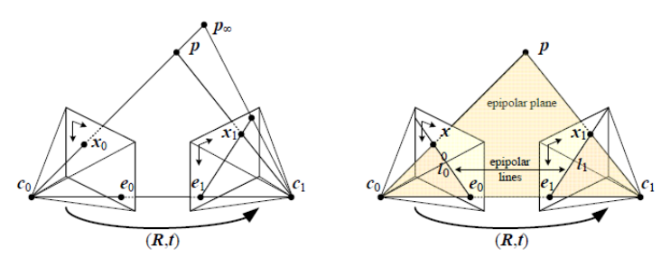
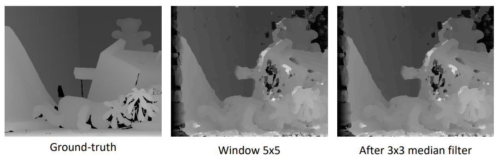
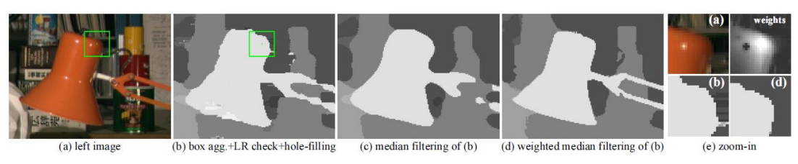
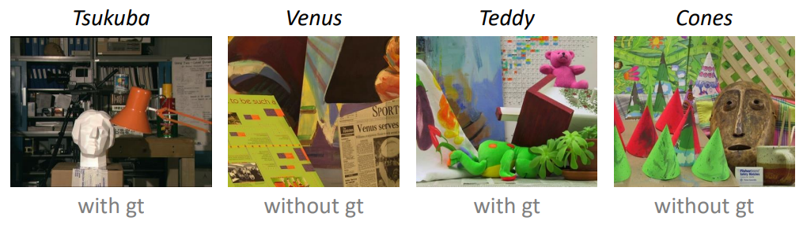

# Stereo Matching
A impletment for Stereo Matching, human’s eyes judge the distance between two objects or the depth of object -> Two eyes perceive same object slightly differently and our brain can merge two images into a 3D image -> That’s Stereo Matching.



### Disparity Estimation



### Disparity Refinement



### Task



## Usage
### Requirement (prerequisite: conda)
Type the following command in your terminal, you should have conda to build the environment.

```sh
git clone https://github.com/willychen0146/Stereo-Matching.git
cd Stereo-Matching
# build the environment
bash build.sh
```

### Quick start

```sh
# you can change the input image if you want.
python3 main.py --image {input_image}

# Compute disparity maps of the left image for the four standard test pairs from Middlebury v2
# Evaluation metric: bad pixel ratio (error threshold = 1)
python3 eval.py --image {input_image}
```